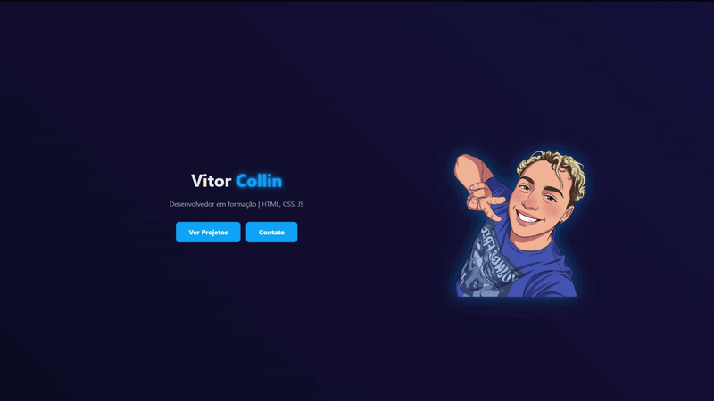

# 💻 Portfólio - Vitor Collin

Este projeto é o meu portfólio pessoal desenvolvido com o objetivo de apresentar minhas habilidades, projetos e evolução como desenvolvedor.

## 🚀 Sobre o projeto

O portfólio foi criado para reunir em um só lugar informações importantes sobre mim, como:

Tecnologias que utilizo
Projetos desenvolvidos
Contato profissional
Apresentação pessoal

Ele funciona como uma vitrine do meu trabalho e será constantemente atualizado conforme evoluo na área de desenvolvimento.

## 🛠️ Tecnologias utilizadas
- HTML5
- CSS3
- JavaScript
- Bootstrap
## 📂 Estrutura do projeto

O projeto é composto por páginas estáticas que incluem:

- Seção "Sobre mim"
- Seção de habilidades
- Seção de projetos
- Contato

## 🎥 Preview do Projeto

## 🛠️ Como executar o projeto

Como este é um projeto front-end estático, não é necessário instalar dependências.

🔹 Opção 1 — Abrir direto no navegador

Baixe ou clone o repositório:

- git clone https://github.com/VitorCollin/portifolio-vitor.git

Acesse a pasta do projeto:

- cd portifolio-vitor

Abra o arquivo:

- index.html

🔹 Opção 2 — Usando Live Server (recomendado)

Se você usa o Visual Studio Code:

- Instale a extensão Live Server

- Clique com o botão direito no index.html

- Clique em "Open with Live Server"

Isso evita problemas com caminhos de arquivos e melhora o desenvolvimento.

## 🎯 Objetivo

Este portfólio tem como principal objetivo:

- Demonstrar minhas habilidades práticas
- Servir como apoio em processos seletivos
- Documentar minha evolução como desenvolvedor
## 📈 Melhorias futuras
- Deploy do projeto (GitHub Pages ou Vercel)
- Responsividade aprimorada
- Animações e interações mais dinâmicas
- Adição de novos projetos
## 📬 Contato
- LinkedIn: (https://www.linkedin.com/in/vitorcollin/)
- Email: (vitor.collin@gmail.com)

## 🧠 Autor
### Desenvolvido por Vitor Collin
